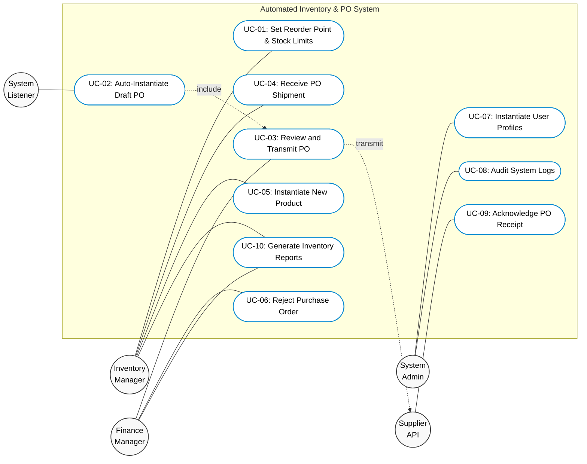
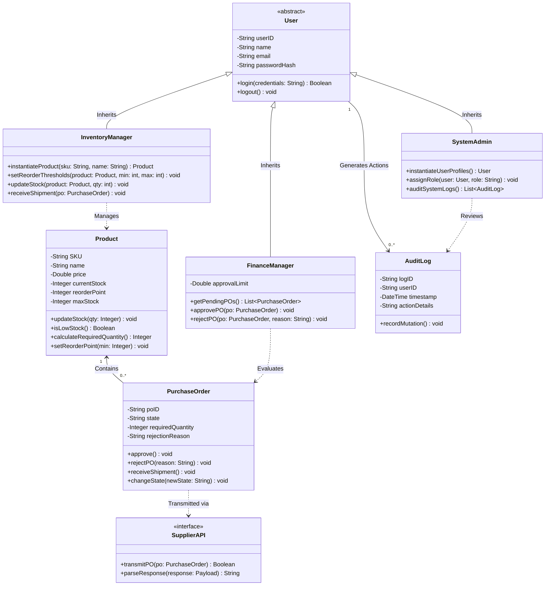
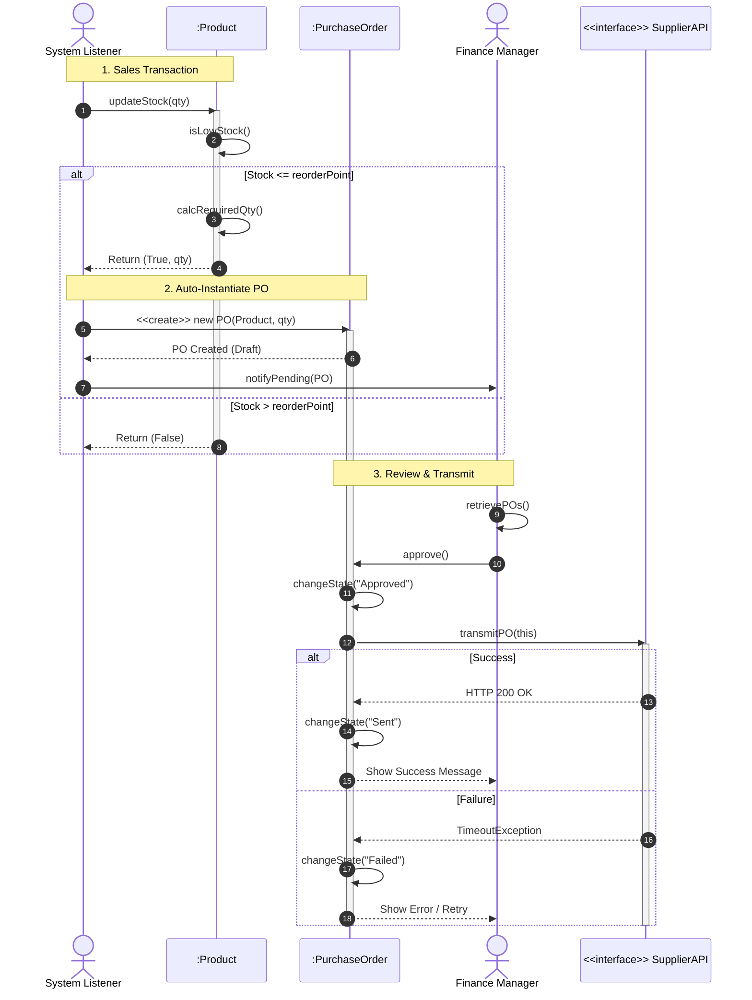

# Automated-Inventory-OOAD-System
A complete Object-Oriented Analysis and Design (OOAD) architecture for an Automated Inventory & PO System, including UML diagrams.

## 📌 System Overview
The system is designed strictly using Object-Oriented Analysis and Design principles to manage warehouse inventory. By representing system entities as interacting objects (e.g., `User`, `Product`, `PurchaseOrder`), the system encapsulates business logic, eliminates human errors, and prevents sudden product shortages. 

When a `Product` object's stock reaches its predefined "Reorder Point", the system auto-instantiates a new `PurchaseOrder` object, routes it to a `FinanceManager` for approval, and transmits it to an external `SupplierAPI`.

## 🏗️ Object-Oriented Principles Applied
* **Encapsulation:** All sensitive data (product quantities, financial limits) are hidden within their respective classes and can only be accessed/modified through secure public methods.
* **Inheritance:** A base abstract class `User` is created. Specific actors like `InventoryManager` and `FinanceManager` inherit from this base class, adding their specific roles.
* **Polymorphism:** The system utilizes interfaces for the `SupplierAPI`, allowing communication with multiple external suppliers using a unified method signature.

---

## 📊 System Modeling Diagrams

### 1️⃣ UML Use Case Diagram


### 2️⃣ UML Class Diagram (Core OOP Structure)


### 3️⃣ UML Sequence Diagram


### 4️⃣ UML Activity Diagram
```mermaid
flowchart TD
    classDef terminal fill:#333,stroke:#333,color:#fff,shape:circle;
    classDef decision fill:#fff9c4,stroke:#333,stroke-width:1.5px,color:#000;
    classDef process fill:#ffffff,stroke:#333,stroke-width:1.5px,color:#000;

    Start((Start)):::terminal
    End((End)):::terminal

    subgraph SysLane ["System (Event Listener)"]
        direction TB
        A1(["Update Product Stock"]):::process
        A2{"Stock <= Reorder Point?"}:::decision
        A3(["Calculate Required Quantity"]):::process
        A4(["Instantiate PO (State: Draft)"]):::process
    end

    subgraph FMLane ["Finance Manager"]
        direction TB
        F1(["Review Pending PO"]):::process
        F2{"Approval Decision?"}:::decision
        F3(["Set State: Rejected & Log Reason"]):::process
    end

    subgraph APILane ["Supplier API"]
        direction TB
        S1(["Transmit PO Data"]):::process
        S2{"Transmission Status?"}:::decision
        S3(["Set State: Failed - Timeout"]):::process
        S4(["Set State: Sent - HTTP 200"]):::process
    end

    Start --> A1
    A1 --> A2
    A2 -->|No - Stock Sufficient| End
    A2 -->|Yes - Low Stock| A3
    A3 --> A4
    A4 --> F1
    
    F1 --> F2
    F2 -->|Reject| F3
    F3 --> End
    
    F2 -->|Approve| S1
    S1 --> S2
    S2 -->|Error| S3
    S3 --> End
    S2 -->|Success| S4
